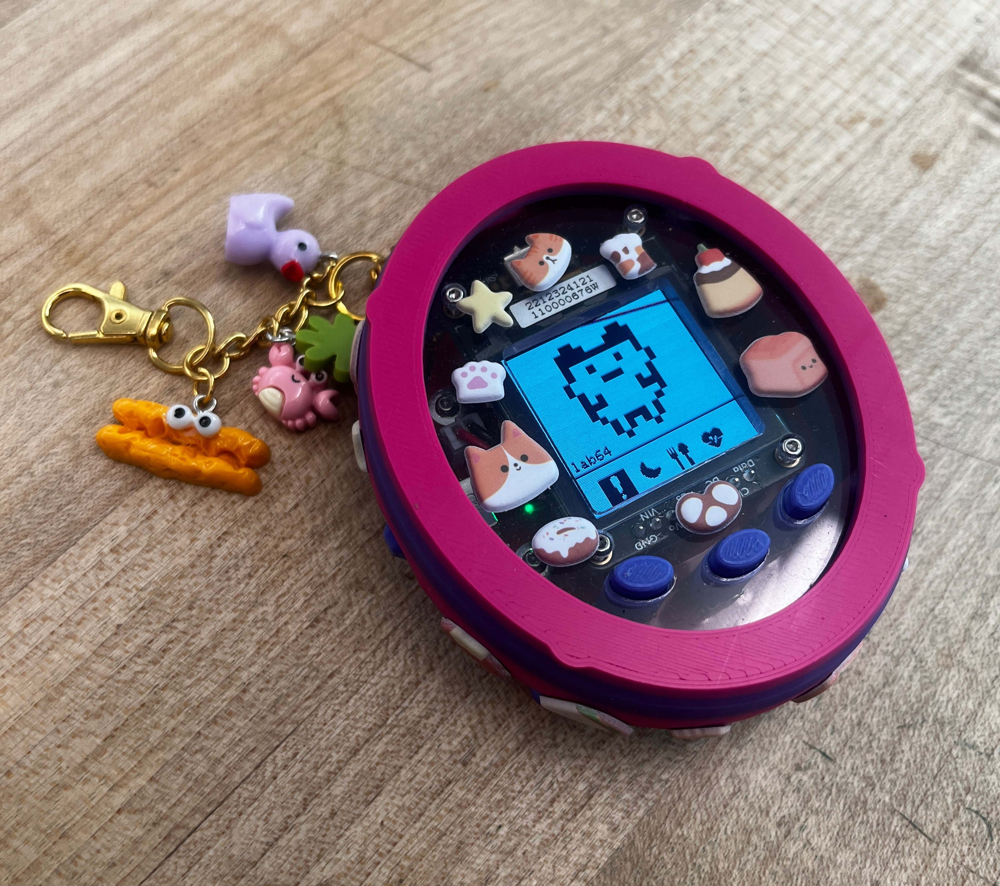
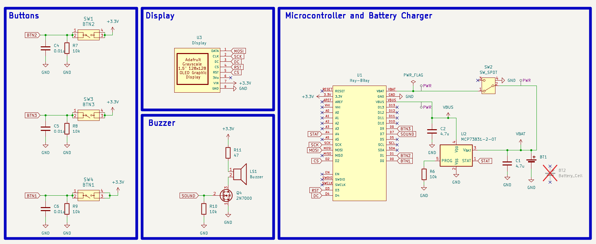
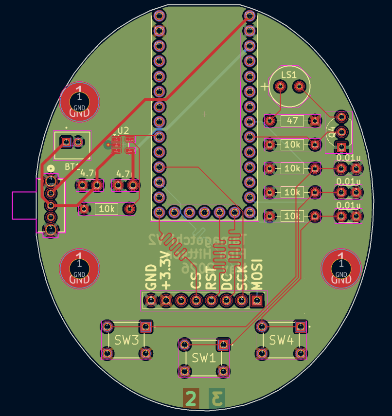
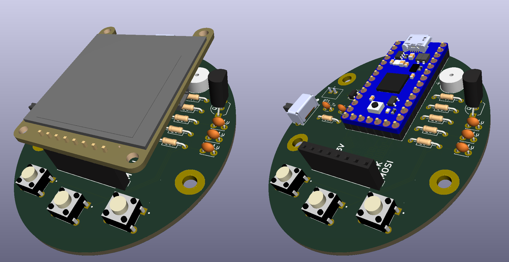
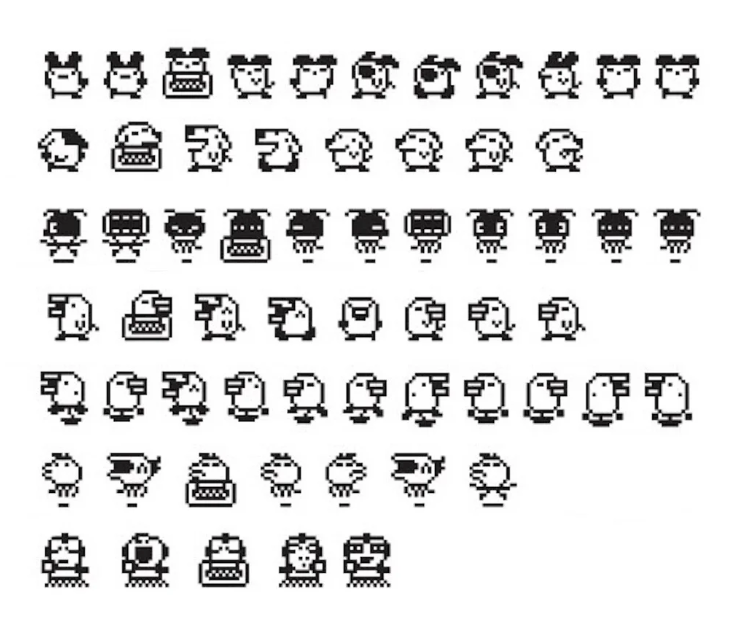
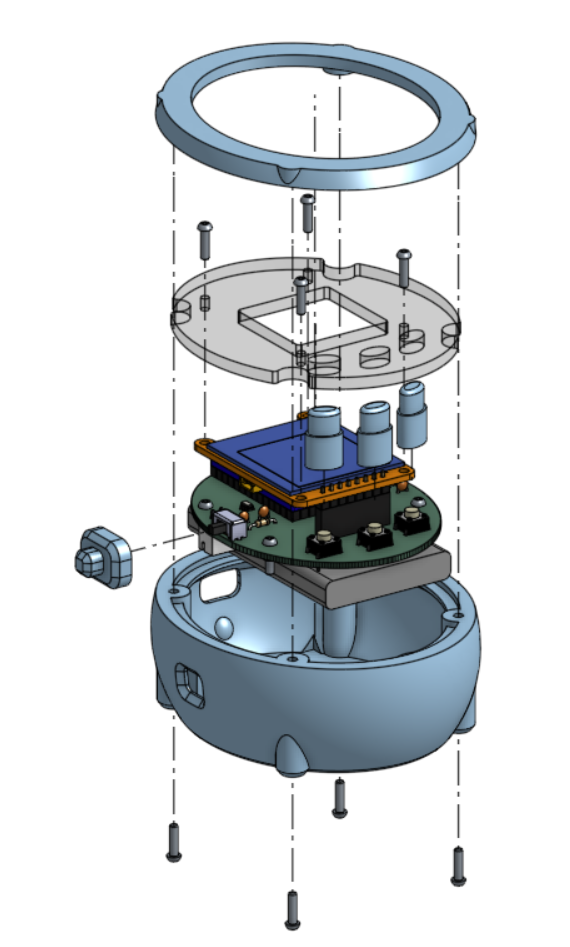

# Tamagotchi Build Workshop

This repo documents a Tamagotchi that was created as a lab64 workshop at Stanford University. The idea of the workshop was for students to come into the lab64 makerspace to receive materials and assembly instructions, spend a few hours building, eat a free dinner, and then leave with a fully assembled and functioning Tamagotchi. This project was a collaboration between me, [Sydney Yan](https://www.linkedin.com/in/sydney-yan/), and [Dani Algazi](https://www.linkedin.com/in/dani-algazi-17a7431b2/). I was responsible for creating the PCB, Sydney wrote all the code, and Dani created the enclosure. To see our Tamagotchi in action please visit this [link](https://youtu.be/EQx-8vsQdow).

## Electrical

The electronics inside the Tamagotchi were a custom PCB that utilized a [ItsyBitsy](https://www.adafruit.com/product/3675?srsltid=AfmBOooAwEcHuKG2jr8HvIwYrDCV_mU2HbkCFx2qz2rQIsxoqrmatH5F) microcontroller, [128x128 OLED Graphic Display](https://www.adafruit.com/product/5297) by Adafruit, a [2000mAh battery](https://www.adafruit.com/product/2011?gad_source=1&gad_campaignid=23986111167&gbraid=0AAAAADx9JvTt9d2v0q4tRx3Alx5nwjkJV&gclid=Cj0KCQjw4JbTBhCoARIsALWUaBv_qoJ-Qvg_jeG3coJ9SOEnbvAB3v0Xe3A2UNFlqi8Rw7P-EVBBnnsaAveREALw_wcB), three buttons, and a few other electronics. A full bill of materials is avaliable in the `electrical/` directory. A schematic of the circuit is the following image.

The buttons are the main control buttons for the Tamagotchi. They are nominally pulled up and go low when pressed. There is also a bypass capacitor to help eliminate switch bounce. The display is controlled by the ItsyBitsy microcontroller through a SPI bus and displays the Tamagotchi and all of its actions. The buzzer is for added sound effects but was never implemented in software due to time constraints. The final block is the ItsyBitsy microcontroller which is connected to a one cell LiPo battery charger circuit. The battery output voltage is fed through a power switch which is then ORed with the VBUS voltage, if present, on the ItsyBitsy breakout board to be regulated to 3.3V and power all other devices. The PCB layout is the following image.

The shape is an oval since most real Tamagotchi's are "egg" shaped. The SPI bus lines are length matched not because we expect to use this board at very high frequencies, but rather because it looks cool and I wanted to try it. At the bottom of the PCB are embedded board labels to make sure the stack up was done in the correct order. We opted for three mounting holes due to spacing and because any plane can be constrained by only three points of contact. The following images are renderings of the PCB with and without the display.

## Software

The software for the Tamagotchi was created and written by [Sydney Yan](https://www.linkedin.com/in/sydney-yan/). Her [repository](https://github.com/sydneyyan/lab64-tamagotchi/tree/main) has installation instructions. The code is structured as an event driven framework. The events were defined as button presses which let the user move their cursor selection between the different actions. The outside most buttons move the cursor either left or right and the middle button is the select button.

Then the middle button allows the user to select the action, and the Tamagotchi would do the action. The actions are screaming, exercising (running), sleeping, and eating (farting).

The images of the Tamagotchi are then translated as a bitmap to the display. We found many images online of Tamagotchi characters and their actions in bitmap images and translated them manually to an array of ones and zeros to be displayed on the OLED 128x128 display. An example of one of these images we considered was the following. With each button press the display changes the bitmap of the Tamagotchi character or the cursor selection to give the animation effect. 

## Mechanical

The enclosure was created and designed by [Dani Algazi](https://www.linkedin.com/in/dani-algazi-17a7431b2/). His Onshpae file for this project is so beautifully organized you have to see [it](https://cad.onshape.com/documents/d4130be6a1970f53ef730a90/w/6fa9feb7c0a58738c3d2d12f/e/90ee6ce4a11ee68d4a759c51?renderMode=0&rightPanel=explodedViewPanel&uiState=6a66a1dc48df1692d50767dd) for yourself. 
The enclosure is made of three main pieces; the top and bottom part of the enclosure, and the front cover. The following exploded view of the assembly shows these parts.

The bottom piece holds the battery and the  PCB in place with heat set inserts embedded into the frame. The translucent front cover piece snaps into the top part of the enclosure. This then fits to the bottom part of the enclosure, sealing the electronics inside. The top part of the enclosure has heat set inserts and screws to the bottom part of the enclosure. We also had to add button and switch extenders so that the user could press the buttons and flip the power switch from the outside of the enclosure. Fully assembled the Tamagotchi 3D rendering looks like the following. The files `Assembly Instructions.pdf` describe how to assemble a Tamagotchi with many more photos explaining each step.

## Special Thanks

Huge thank you to Dani and Sydney for helping me create this. It was a ton of fun to work with you and see our rendition of Tamagotchi come to life. Lets do it again.
